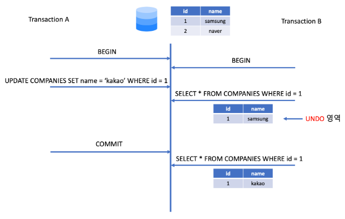
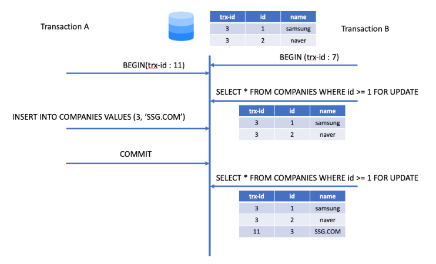
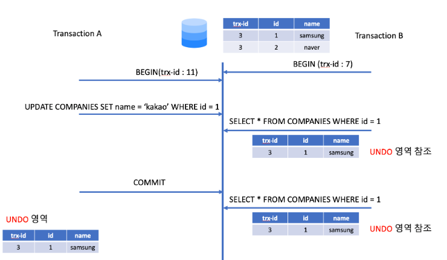

# 05.트랜잭션과 잠금
- MySQL의 동시성에 영향을 미치는 3가지 소개
- 잠금(Lock)
    - 동시성을 제어하기 위한 기능
- 트랜잭션
    - 데이터의 정합성을 보장하기 위한 기능
    - 논리적인 작업셋을 모두 완벽하게 처리
    - 처리하지 못할 경우에는 원 상태로 복구해서 작업의 일부만 작용되는 현상(Partial Update)이 발생하지 않게 만들어주는 기능
- 트랜잭션의 격리수준(Isolation level)
## 5,1 트랜잭션
### 5.1.1 MySQL에서의 트랜잭션
- 엔진별 PK 중복 오류로 쿼리가 실패했을 때 트랜잭션 처리 (Auto Commit 가정)
    - `Memory`, `MyISAM` 엔진의 경우 중복 오류나지 않는 레코드만 부분 업데이트 처리
        -  부분 업데이트 현상이 발생하면 실패한 쿼리로 인해 남은 레코드를 다시 삭제하는 재처리 작업이 필이ㅛ할 수 있음  
    - `InnoDB` 엔진의 경우 쿼리 중 일부라도 오류가 발생하면 전체를 원 상태로 만듦
- `Memory`, `MyISAM` 엔진에서 부분 업데이트 현상을 방지하려면 DML 단위마다 `IF`/`ELSE` 문을 넣어줘야 하는 번거로움
- `InnoDB`의 경우 트랜잭션 지원이 되어 상대적 깔끔한 코드로 작성

### 5.1.2 주의사항
- 트랜잭션 또한 DBMS의 커넥션과 동일하게 꼭 필요한 최소의 코드에만 적용하는 것이 좋음
- 프로그램 코드에서 트랜잭션의 범위를 최소화해야 함
- 트랜잭션 처리 예시
    - 사용자가 게시판에 게시물을 작성한 후 저장 버튼을 클릭했을 때 서버에서 처리하는 순서
        1. 처리 시작
            - 데이터베이스 커넥션 생성
            - `트랜잭션 시작`
        2. 사용자의 로그인 여부 확인
        3. 사용자의 글쓰기 내용의 오류 여부 확인
        4. 첨부로 업로드된 파일 확인 및 저장
        5. **사용자의 입력 내용을 DBMS에 저장**
        6. **첨부 파일 정보를 DBMS에 저장**
        7. **저장된 내용 또는 기타 정보를 DBMS에 저장**
        8. 게시물 등록에 대한 알림 메일 발송
        9. **알림 메일 발송 이력을 DBMS에 저장**
            - `트랜잭션 종료`
            - 데이터베이스 커넥션 반남
        10. 처리 완료
    - 개선 사항
        - 불필요한 커넥션 소유
            - 실제 트랜잭션 필요한 부분은 5번부터 시작하나, 처음부터 트랜잭션을 열어 여유 커넥션 소유 시간이 길어짐
            - 여유 커넥션 개수가 줄어듦
        - 8번 작업 시 메일 전송이나 FTP 파일 전송 작업 또는 네트워크를 통해 원격 서버와 통신할 때 DBMS의 트랜잭션 내에서 제거하는 것이 좋음
            - 프로그램 실행 중 메일 서버와 통신할 수 없는 상황 발생 시 DBMS 서버도 위험해질 수 있음
        - 하나의 트랜 잭션 내 4개의 DMBS 작업이 있음. 아래와 같이 분리할 수 있음
            - 입력한 정보 저장하는 5,6번 묶어 하나의 트랜잭션으로 실행
            - 이력 정보 저장이라 5,6번과 9번은 분리해서 실행
            - 데이터 단순 확인 및 조회인 7번은 트랜잭션에 포함할 필요 없음
    - 트랜잭션 처리 개선ver
        1. 처리 시작
        1. 사용자의 로그인 여부 확인
        1. 사용자의 글쓰기 내용의 오류 발생 여부 확인
        1. 첨부로 업로드된 파일 확인 및 저장
            - 데이터베이스 커넥션 생성
            - `트랜잭션 시작`
        1. **사용자의 입력 내용을 DBMS에 저장**
        1. **첨부 파일 정보를 DBMS에 저장**
            - `트랜잭션 종료`
        1. **저장된 내용 또는 기타 정보를 DBMS에 조회**
        1. 게시물 등록에 대한 알림 메일 발송
            - `트랜잭션 시작`
        1. **알림 메일 발송 이력을 DBMS에 저장**
            - `트랜잭션 종료`
            - 데이터베이스 커넥션 종료
        1. 처리 완료

</br>

## 5.2 MySQL 엔진의 잠금
- MySQL에서 사용되는 잠금
    - 스토리지 엔진 레벨
    - MySQL 엔진 레벨(스토리지 엔진을 제외한 나머지 부분)
        - 테이블 락
        - 메타데이터 락
        - 네임드 락
### 5.2.1 글로벌 락
- 글로벌 락
    - 글로벌 락은 MySQL에서 제공하는 잠금 가운데 가장 범위가 큰 락
    - `FLUSH TABLES WITH READ LOCK` 명령으로 글로벌 락 획득
    - MySQL 서버 전체에 영향을 미쳐, 모든 테이블, 데이터베이스에 대해 락 걸림
        - 한 세션에서 글로벌 락을 획득하면, 다른 세션에서 `SELECT`을 제외한 대부분의 DDL, DML 모두 락 걸림     
    - `MyISAM`이나 `MEMORY` 테이블에 대해 `mysqldump`로 일관된 백업을 받아야 할 때는 글로벌 락 사용
- 백업 락(가벼운 글로벌 락)
    - 8.0 버전부터 안정적인 실행을 위해 백업 락 도입됨
    - 주로 레플리카 서버에서 실행됨
        - 서버 복제와 백업을 동시에 하기 위해서 도입
        - 정상적으로 복제는 되지만, 백업의 실패를 막기 위해 DDL명령이 실행되면 복제를 일시 중지하는 역할을 함
    - 락 범위
        - 테이블의 스키마나 사용자의 인증 관련만 락 걸어줌
        - 데이터베이스 및 테이블 등 모든 객체 생성 및 변경, 삭제
        - `REPAIR TABLE`과 `OPTIMIZE TABLE`명령
        - 사용자 관리 및 비밀번호 변경
        - *백업 락은 일반적인 테이블 변경은 허용됨*

### 5.2.2 테이블 락
- 개별 테이블 단위로 설정되는 락
- 묵시적, 명시적으로 테이블 락 획득 가능 (명시적인 테이블 락은 거의 안씀)
- 묵시적 락
    - `MyISAM`,`MEMORY` 엔진은 테이블 단위 락이 발생하기 때문에, 데이터 변경 쿼리 날리면 묵시적 테이블 락 발생
    - 쿼리 완료 후 자동 해제
- 명시적 락
    - 명시적 획득: `LOCK TABLES tables_name [ READ | WRITE ]`
    - 명시적 락 해제: `UNLOCK TABLES`
### 5.2.3 네임드 락
- `GET_LOCK()` 함수를 이용해 임의의 문자열에 대해 락
- 특징
    - 대상이 테이블이나 레코드 또는 `AUTO_INCREMENT`와 같은 데이터베이스 객체가 아님
    - 단순히 사용자가 지정한 문자열에 대해 획득하고 반납하는 잠금
    - 자주 사용되지 않고, 특정 상황에서만 사용
- 네임드 락 사용하는 경우
    - DB 서버 1대에 5대의 웹 서버가 접속해서 서비스하는 상황에서 5대의 웹 서버가 어떤 정보를 동기화해야 하는 요건처럼 여러 클라이언트가 상호 동기화를 처리해야 할 때 네임드 락을 이용하면 쉽게 해결
    - 많은 레코드에 대해서 복잡한 요건으로 레코드를 변경하는 트랜잭션에 유용하게 사용 가능

### 5.2.4 메타데이터 락
- 데이터베이스 객체의 이름이나 구조를 변경하는 경우에 획득하는 락
- 명시적으로 획득할 수 없고, 메타데이터 변경 시 자동 획득/해제

</br>

## 5.3 InnoDB 스토리지 엔진 잠금
- 레코드 기반 락 방식 탑재
- 락 관련 테이블
    - `information_schema.INNODB_TRX`
    - `information_schema.INNODB_LOCKS`
    - `information_schema.INNODB_LOCK_WAITS`
### 5.3.1 InnoDB 스토리지 엔진의 잠금
#### 5.3.1.1 레코드 락
- 레코드 자체만을 잠그는 것을 레코드 락이라고 함
- 다른 DBMS와는 다르게, 레코드 자체가 아니라 인덱스의 레코드를 잠금
- 인덱스가 없는 테이블이라도 내부적으로 자동 생성된 PK인덱스를 이용해 잠금
#### 5.3.1.2 갭 락
- 갭 락은 레코드 자체가 아니라 레코드와 바로 인접한 레코드 사이의 간격만을 잠그는 것
- 갭 락은 레코드와 레코드 사이의 간격에 레코드가 생성되는 것을 제어하는 역할
- 갭 락 자체보다 넥스트 키 락의 일부로 자주 사용됨
#### 5.3.1.3 넥스트 키 락
- 레코드 락과 갭 락을 합쳐 놓은 형태의 잠금을 넥스트 키 락이라고 함
- `REPEATABLE READ` 격리 수준을 사용해야 함
- `innodb_locks_unsafe_for_binlog` 시스템 변수가 비활성화되면 넥스트 키 방식으로 잠김
- 갭 락,넥스트 키 락의 주 목적은 바이너리 로그에 기록되는 쿼리가 레플리카 서버에서 실행될 때 소스 서버에서 만들어 낸 결과와 동일한 결과를 만들어내도록 보장하기 위함
- 갭 락,넥스트 키 락으로 인해 데드락이 발생하거나 다른 트랜잭션을 기다리게 만드는 일이 자주 발생함
    - 가능하다면 바이너리 로그 포맷을 ROW 형태로 바꿔서 넥스트 키 락이나 갭 락을 줄이는 것이 좋음
#### 5.3.1.4 자동 증가 락
- 동시에 여러 레코드가 `INSERT`되는 경우 `AUTO_INCREMENT`를 위해 내부적으로 `AUTO_INCREMENT LOCK` 잠금 실행
- 새로운 레코드를 저장하는 `INSERT`, `REPLACE` 쿼리에서만 걸림
- `AUTO_INCREMENT LOCK`은 아주 짧은 시간동안 걸렸다가 해제되어 대부분의 경우 문제가 되지 않음

### 5.3.2 인덱스와 잠금
- 변경해야 할 레코드를 찾기 위해 검색한 인덱스의 레코드를 모두 락을 걸어야 함
- 변경할 레코드 조건으로 명시된 컬럼들 중 인덱스에 없는 컬럼이 있다면, 스캔 범위의 레코드들이 모두 락이 걸림
### 5.3.3 레코드 수준의 잠금 확인 및 해제
- 잠금 및 대기 순서 확인
    ```sql
        SELECT
            r.trx_id wating_trx_id,
            r.trx_mysql_thread_id waiting_thread,
            r.trx_query wating_query,
            b.trx_id blocking_trx_id,
            b.trx_mysql_thread_id blocking_thread,
            b.trx_query blocking_query
        FROM performance_schema.data_lock_waits w 
        INNER JOIN information_schema.innodb_trx b
         ON b.trx_id= w.blocking_engine_transaction_id
        INNER JOIN information_schema.innodb_trx r
         ON r.trx_id= w.requesting_engine_transaction_id;
    ```
- 위 쿼리문 결과로 `wating_thread_id`와 `blocking_thread_id`를 확인하여, 먼저 잠겨있는 스레드를 `KILL`로 강제 종료

</br>

## 5.4 MySQL의 격리 수준
- 격리 수준이란?
    - 여러 트랜잭션이 동시에 처리될 때 특정 트랜잭션이 다른 트랜잭션에서 변경하거나 조회하는 데이터를 볼 수 있게 허용할 지 말 지를 결정하는 것
- MySQL에서는 `REPEATABLE READ`를 주로 사용
- 세 가지 부정합 문제
    - **DIRTY READ**        
        - 아직 커밋되지 않은 수정 중인 데이터를 다른 트랜잭션에서 읽을 수 있도록 허용할 때 발생
        - 이 상황에서는 열린 트랜잭션의 결과를 모르기 때문에 읽는 데이터의 일관성에 대해 확신할 수 없고, 이는 ACID 원칙에 위배됨
    - **NON-REPEATABLE READ**
        - 한 트랜잭션 내에서 똑같은 `SELECT` 쿼리를 실행했을 때 항상 같은 결과를 가져오지 않는 현상
        
    - **PHANTOM READ**
        - 다른 트랜잭션에서 수행한 변경 작업에 의해 레코드가 보였다가 안 보였다가 하는 현상
        - Non-Repeatable Read의 한 가지 경우이며 Transaction A가 범위를 조회하는 `SELECT`...`WHERE` 쿼리를 반복적으로 사용할 때, 그 쿼리들 사이에서 Transaction B가 해당 `WHERE`절을 만족하는 새로운 행을 생성했을 때 발생함
        
- 격리 수준의 레벨에 따른 세 가지 부정합 문제
    |  | **DIRTY READ** | **NON-REPEATABLE READ** | **PHANTOM READ** |
    | --- | --- | --- | --- |
    | **READ UNCOMMITTED**| 발생 | 발생 | 발생 |
    | **READ COMMITTED** | 없음 | 발생 | 발생 |
    | **REPEATABLE READ** | 없음 | 없음 | 발생(InnoDB는 없음) |
    | **SERIALIZABLE** | 없음 | 없음 | 없음 |

### 5.4.1 READ UNCOMMITTED
- 각 트랜잭션에서의 변경 내용이 `COMMIT`이나 `ROLLBACK` 여부에 상관없이 다른 트랜잭션에서 보임
- 더티 리드를 유발해서 RDBMS 표준에서 트랜잭션의 격리 수준으로 인정하지 않을 정도로 데이터 정합성에 문제가 많은 격리 수준이라고 함
- MySQL을 사용한다면 최소한 `READ COMMITTED` 이상의 격리 수준을 사용할 것을 권장

### 5.4.2 READ COMMITTED
- 오라클에서 기본으로 사용되는 격리 수준이며, 온라인 서비스에서 가장 많이 선택됨
- 이 레벨에선 더티 리드 같은 현상이 발생하지 않음
- 이 레벨에서 NON-REPEATABLE READ라는 부정합의 문제가 있음

### 5.4.3 REPEATABLE READ
- MySQL의 InnoDB에서 기본으로 사용하는 트랜잭션 격리 수준
- 트랜잭션 범위 내에서 조회한 내용이 항상 동일함을 보장함
- 트랜잭션은 고유한 번호를 가지며 Undo 영역에 백업된 모든 레코드에는 변경을 발생시킨 트랜잭션의 번호가 포함되어 있음
- 하나의 트랜잭션 내에서 일어나는 모든 SELECT 쿼리는 자신의 트랜잭션 번호보다 작은 트랜잭션 번호에서 변경한 사항들만 볼 수 있음 (이러한 방식을 MVCC라고 함)


### 5.4.4 SERIALIZABLE
- 가장 단순하면서 엄격한 격리 수준이나, 동시 처리 성능이 많이 떨어짐
- 한 트랜잭션에서 읽고 쓰는 레코드를 다른 트랜잭션에서 절대 접근할 수 없음
- InnoDB 스토리지 엔진에선 갭 락과 넥스트 키 락 덕분에 `REPEATABLE READ` 격리 수준에서도 이미 `PHANTOM READ`가 발생하지 않기 때문에 **굳이 `SERIALIZEABLE`을 사용할 필요성은 없어 보임**

</br>

# 06.데이터 압축
- 디스크의데이터 파일이 크면 클수록 백업/복구 시간이 오래 걸리며, 그만큼의 저장 공간이 필요
- 이러한 문제점을 해결하기 위해 데이터 압축 기능을 제공

</br>

## 6.1 페이지 압축
- 버퍼 풀에 데이터 페이지가 한 번 적재되면 InnoDB 스토리지 엔진은 압축이 해제된 상태로만 데이터 페이지를 관리함
    - 압축: MySQL 서버가 디스크에 저장하는 시점에 데이터 페이지가 압축되어 저장
    - 해제: MySQL 서버가 디스크에서 데이터 페이지를 읽어올 때 압축이 해제
- 페이지 압축 작동 방식
    1. 16KB 페이지를 압축
    1. MySQL 서버는 디스크에 압축된 결과 7KB를 기록
        - 이때, MySQL 서버는 압축 데이터 7KB에 9KB의 빈 데이터를 기록
    1. 디스크에 데이터를 기록한 후, 7KB 이후의 공간 9KB에 대해 펀치 홀 생성
    1. 파일 시스템은 7KB만 남기고 나머지 디스크의 9KB 공간은 다시 운영체제로 반납
- 펀치 홀 기능을 사용하지 못하는 경우가 있어, **실제 페이지 압축은 많이 사용되지 않음**
    - 펀치 홀 기능은 OS뿐만 아니라 하드웨어 체제에서도 해당 기능을 지원해야 사용 가능
    - 아직 파일 시스템 관련 명령어가 펀치 홀을 지원하지 못함

</br>

## 6.2 테이블 압축
- 장점
    - OS나 하드웨어에 대한 제약 없이 사용할 수 있어, 일반적으로 활용도가 더 높음
    - 디스크의 데이터 파일 크기를 줄일 수 있음
- 단점
    - 버퍼 풀 공간 활용률이 낮음
    - 쿼리 처리 성능이 낮음
    - 빈번한 데이터 변경 시 압축률이 떨어짐

### 6.2.1 압축 테이블 생성
- 압축을 사용하기 위한 전제 조건
    - 압축 사용하려는 테이블이 별도의 테이블 스페이스를 사용해야 함
    - `innodb_file_per_table` 시스템 변수가 ON으로 설정된 상태에서 테이블이 생성돼야 함
    - 테이블 생성 시 `ROW_FORMAT=COMPRESSED`옵션을 명시해야 함
    - `KEY_BLOCK_SIZE`옵션으로 압축된 페이지의 목표 크기 명시 가능(2n으로만 설정 가능)
- 압축을 적용하는 방법
    1. 16KB의 데이터 페이지를 압축
    
        (1) 압축된 결과가 8KB 이하면 그대로 디스크에 저장
           
        (2) 압축된 결과가 8KB 초과하면 원본 페이지를 스플릿해서 2개의 페이지에 8KB씩 저장
    1. 나뉜 페이지 각각에 대해 '1'번 단계를 반복 실행

### 6.2.2 KEY_BLOCK_SIZE 설정
- 테이블 압축에서 가장 중요한 부분은 압축된 결과를 예측해서 `KEY_BLOCK_SIZE`를 결정하는 것
- `KEY_BLOCK_SIZE` 적용하기 전 4KB 또는 8KB로 테이블 생성해서 샘플 데이터를 저장해보고 적절한지 판단하는 것이 좋음
- 최소한 테이블의 데이터 페이지가 10개 정도는 생성되도록 테스트 데이터를 `INSERT`해보는 것이 좋음

### 6.2.3 압축된 페이지의 버퍼 풀 적재 및 사용
- 압축된 테이블의 데이터 페이지를 버퍼 풀에 적재하면 압축된 상태와 압축이 해제된 상태 2개 버전을 관리함
    - LRU 리스트는 디스크에서 읽은 상태 그대로의 데이터 페이지 목록이 관리됨
    - Unzip_LRU 리스트는 압축을 해제한 상태의 데이터 페이지 목록이 별도로 관리됨
- 버퍼 풀에서 압축 해제된 버전의 데이터 페이지를 적절한 수준으로 유지하기 위해 다음과 같은 어댑티브 알고리즘을 사용함
    - CPU 사용량이 높은 서버에서는 가능하면 압축과 압축 해제를 피하기 위해 Unzip_LRU의 비율을 높여서 유지함
    - Disk IO 사용량이 높은 서버에서는 가능하면 Unzip_LRU 리스트의 비율을 낮춰서 InnoDB 버퍼 풀의 공간을 더 확보하도록 작동함

### 6.2.4 테이블 압축 관련 설정
- 테이블 압축을 사용할 때 연관된 시스템 변수 소개
    - `innodb_cmp_per_index_enabled`
        - 테이블 압축이 사용된 테이블의 모든 인덱스별로 압축 성공 및 압축 실행 횟수를 수집하도록 설정
    - `innodb_compression_level`
        - 압축률을 설정하는 변수이고, 0~9 까지의 값 중에서 선택할 수 있음
        - 값이 작을수록 압축 속도(CPU자원 소모량)는 빨라지지만 저장 공간은 커질 수 있음
        - 값이 클수록 압축 속도(CPU자원 소모량)는 느려지지만 압축률은 높아짐
    - `innodb_compression_failure_threshold_pct`, `innodb_compression_pad_pct_max`        
    - `innodb_log_compressed_pages`
        