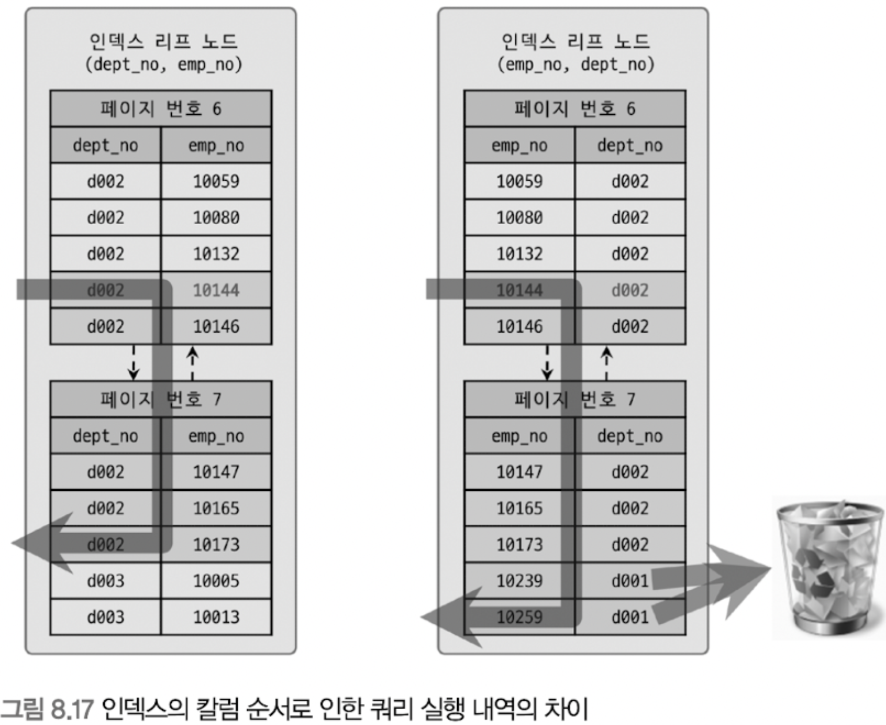
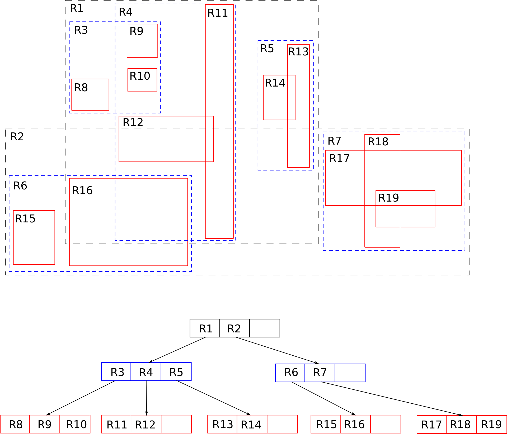
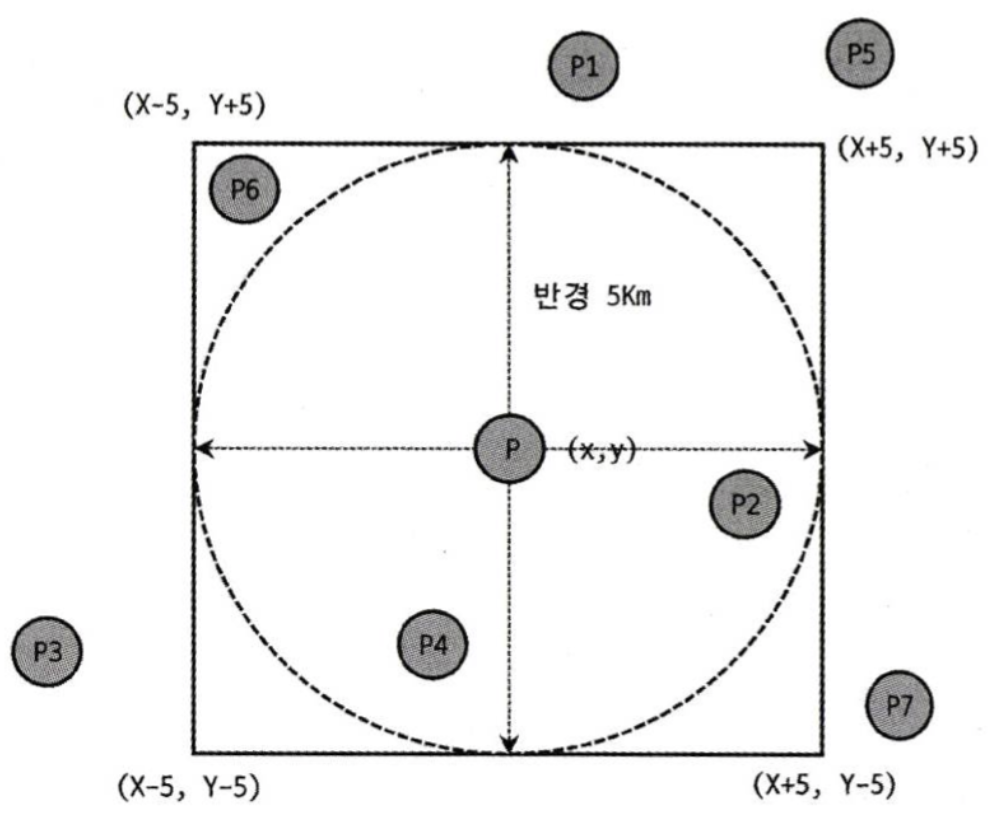

# 08.인덱스

</br>

## 8.1 디스크 읽기 방식
- 랜덤 I/O > index에서 레코드를 찾아 테이블 레코드를 가져올 때 발생
    > 데이터베이스 서버에서 스캔 시 순차 I/O 비중은 크지 않고, 랜덤 I/O 를 통해 작은 데이터를 읽고 쓰는 작업이 대부분임
    - 튜닝의 목적은 랜덤 I/O를 줄이는 것
- 순차 I/O > index 스캔할 때 발생, full table 스캔 시 발생

### 8.1.1 하드 디스크 드라이브(HDD)와 솔리드 스테이트 드라이브(SSD)
- `SSD`는 기존 `HDD`에서 데이터 저장용 플래터(원판)를 제거하고 그 대신 **플래시 메모리**를 장착하고 있음
    - 플래시 메모리는 전원이 공급되지 않아도 데이터가 삭제되지 않음
    - 컴퓨터 메모리보다는 느리지만 기계식 `HDD`보다 훨씬 빠름
- 대부분 `SSD`는 기존 `HDD`보다 용량이 적은데 가격은 비싼 편이지만, 요즘 DBMS용으로 사용할 서버에는 대부분 `SSD`를 채택하고 있음
- `SSD` 장점
    - `HDD`보다 랜덤 I/O가 훨씬 빠름
    - 트랜잭션 처리 속도 약 7배 빠름(책 기준)

### 8.1.2 랜덤 I/O와 순차 I/O
- 3개의 페이지를 디스크에 기록할 때
    - 순차 I/O는 1번 시스템 콜 요청 = 디스크의 헤더를 1번 움직임
    - 랜덤 I/O는 3번 시스템 콜 요청 = 디스크의 헤더를 3번 움직임
- 디스크 원판을 가지지 않는 `SSD`는 순차, 랜덤 간 차이가 없을 것으로 예측하지만 실제로는 차이가 있음
    - 랜덤 I/O가 순차 I/O보다 전체 스루풋이 떨어짐

</br>

## 8.2 인덱스란?
- DBMS에서 인덱스는 **데이터의 저장(INSERT, DELETE, UPDATE) 성능을 희생하고 그 대신 데이터의 읽기(SEELCT) 속도를 높여주는 기능**
- WHERE절에 사용되는 컬럼이라고 전부 인덱스를 생성하면 데이터 저장 성능이 떨어지고, 인덱스의 크기가 비대해져 역효과 발생
- 인덱스 역할별 구분
    - `Primary Key Index`: 레코드를 식별할 수 있는 대표 컬럼으로 생성, Null값과 중복을 허용하지 않음
    - `Secondary Key Index`: 유니크 인덱스와 성격이 비슷하고, 대체 키라고도 함
- 인덱스 알고리즘별 구분
    - `B-Tree 알고리즘`: 컬럼의 값을 변형하지 않고, 원래의 값을 이용해 인덱싱. 가장 일반적으로 사용되는 인덱스 알고리즘
    - `Hash Index 알고리즘`: 해시값을 계산해서 인덱싱하고, 값의 일부만 검색하거나 범위 검색할 땐 사용할 수 없음. 주로 메모리 기반의 데이터베이스에서 많이 사용됨

</br>

## 8.3 B-Tree 인덱스

### 8.3.1 구조 및 특성
- 기본적인 구조는 루트-브랜치-리프 노드로 트리 구조임
- 루트,브랜치 노드는 (인덱스 키, 자식노드 주소)로 구성되어 있음
- 리프 노드는 자식노드 주소 대신 실제 데이터 레코드를 찾아가기 위한 주솟값을 가지고 있음

### 8.3.2 B-Tree 인덱스 키 추가 및 삭제

#### 8.3.2.1 인덱스 키 추가
- 새로운 키 값이 B-Tree에 저장될 때
    - 저장될 위치 검색
    - 레코드의 키 값과 대상 레코드의 주소 정보를 리프 노드에 저장
    - 리프 노드가 꽉 찼으면 리프 노드 스플릿 발생하여, 브랜치 노드까지 처리 범위가 넓어짐
- 인덱스 추가 비용 대략적 계산 방법
    - 테이블에 레코드를 추가하는 작업 비용을 1이라고 했을 때
    - 인덱스에 키를 추가하는 비용을 1.5 정도로 예측
    - 인덱스가 하나도 없는 경우는 작업 비용이 1
    - 인덱스가 3개인 경우는 작업 비용이 5.5 (1.5*3 + 1)

#### 8.3.2.2 인덱스 키 삭제
- 삭제할 레코드의 키 값이 저장된 리프 노드를 찾아서 삭제 마킹 > 디스크 I/O 발생
- 삭제 마킹된 인덱스 키 공간은 방치하거나 재활용 가능

#### 8.3.2.3 인덱스 키 변경
- 먼저 키 값을 삭제 후, 다시 새로운 키 값을 추가하는 형태로 처리됨
- 인덱스 키 삭제 -> 인덱스 키 추가

#### 8.3.2.4 인덱스 키 검색
- 인덱스 검색은 100% 일치 또는 값의 앞부분(Left-most part)만 일치하는 경우 사용 가능
- 검색 시 인덱스 키 변형되면 안됨

### 8.3.3 B-Tree 인덱스 사용에 영향을 미치는 요소

#### 8.3.3.1 인덱스 키 값의 크기
- 인덱스, 디스크에 저장되는 데이터 모두 페이지 단위로 관리됨
    - 페이지의 기본 크기는 16 KB
- 인덱스를 캐시해 두는 InnoDB의 버퍼 풀의 크기는 제한적이라 인덱스 크기가 커질수록 메모리에 캐시해 둘 수 있는 레코드 수는 줄어듦

#### 8.3.3.2 B-Tree 깊이
- 인덱스의 깊이는 중요하지만 직접 제어할 방법은 없음
- 인덱스 키값의 크기는 가능하면 작게 만드는 것이 좋음
    - 인덱스 키 값의 크기가 커질수록 하나의 인덱스 페이지가 담을 수 있는 인덱스 키 값의 개수가 적어짐
    - 같은 레코드 건수라 하더라도 B-Tree의 깊이가 깊어져서 디스크 읽기가 더 많이 필요하게 됨

#### 8.3.3.3 선택도(기수성)
- 선택도란 모든 인덱스 키 값 중 유니크한 값의 수를 의미함
- 인덱스 키 값 중 중복 값이 많아질수록 기수성은 낮아지고 동시에 선택도 또한 떨어짐
- 유니크한 값의 개수는 인덱스의 통계정보에 저장됨
- 인덱스는 선택도가 높을수록 검색 대상이 줄어들기 때문에 그만큼 빠르게 처리됨 > 인덱스 스캔 범위가 줄어듦

#### 8.3.3.4 읽어야 하는 레코드의 건수
- 인덱스의 손익 분기점인 전체 레코드의 20~25%보다 큰 범위의 데이터를 읽어야 하는 경우 풀스캔이 더 좋음

### 8.3.4 B-Tree 인덱스를 통한 데이터 읽기

#### 8.3.4.1 인덱스 레인지 스캔
- 인덱스 접근 방법 중 가장 대표적인 접근 방식으로 접근 방식 중 가장 빠름
- 검색해야 할 인덱스의 범위가 결정됐을 때 사용하는 방식
- 커버링 인덱스란? 인덱스에 필요한 데이터(컬럼들)가 모두 존재하는 경우 디스크의 레코드를 읽는 과정을 생략할 수 있음
    - 랜덤 I/O 생략
- 참고)인덱스 탐색(수직적 탐색)과 인덱스 스캔(수평적 탐색)이 얼마나 수행됐는지 조회하는 쿼리문
    - `Handler_read_key`는 수직점 탐색 횟수
    - `Handler_read_next`와 `Handler_read_prev`는 수평적 탐색으로 읽은 레코드 건수
    - `Handler_read_first`와 `Handler_read_last` 인덱스의 첫 번째 레코드와 마지막 레코드를 읽은 횟수
    ```sql
    SHOW STATUS LIKE 'Handler_%';
    +--------------------------+---------+
    | Variable_name            | Value   |
    +--------------------------+---------+
    | Handler_read_first       | 71      |
    | Handler_read_last        | 1       |
    | Handler_read_key         | 567     |
    | Handler_read_next        | 3447233 |
    | Handler_read_prev        | 19      |
    ...
    ```
    
#### 8.3.4.2 인덱스 풀 스캔
- 인덱스의 처음부터 끝까지 모두 읽는 방식
- 인덱스 선두 컬럼이 아닌 인덱스 컬럼으로 검색하는 경우 사용됨
- 인덱스 레인지 스캔보단 느리지만 테이블 풀 스캔보단 빠름

#### 8.3.4.3 루스 인덱스 스캔
- MySQL의 루스 인덱스 스캔은 오라클의 인덱스 스킵 스캔과 작동 방식이 비슷하다. 루스 인덱스 스캔은 말 그대로 느슨하게 또는 듬성듬성하게 인덱스를 읽는 것을 의미함
- 인덱스 레인지 스캔과 비슷하게 작동하지만 중간에 필요하지 않은 인덱스 키 값은 무시하고 넘어가는 형태로 처리됨
- 일반적으로 GROUP BY 또는 MAX(), MIN() 함수에 대해 최적화를 하는 경우 사용함
- MySQL 5.7 버전까지는 기능이 많이 제한적이었지만, MySQL 8.0 버전부터 최적화를 지원하기 시작했다.

#### 8.3.4.4 인덱스 스킵 스캔
- 인덱스 스킵 스캔은 MySQL 8.0 버전에 추가된 최적화 기능으로 조건절에 첫 번째 인덱스가 없어도 두 번째 인덱스만으로 인덱스를 검색할 수 있게 해주는 기능
- 단점
    - WHERE 조건절에 조건이 없는 인덱스의 선행 컬럼의 유니크한 값의 개수가 적어야 함
    - 쿼리가 인덱스에 존재하는 컬럼만으로 처리 가능해야 함(커버링 인덱스)
- MySQL 8.0 버전에 인덱스 스킵 스캔 최적화 기능이 도입되면서 옵티마이저가 A 컬럼을 건너뛰어서 B, C 컬럼만으로도 인덱스 검색이 가능하게 되었음
- `GROUP BY`의 인덱스 처리에만 사용할 수 있었던 루스 인덱스 스캔과는 다르게 인덱스 스킵 스캔은 WHERE 조건절의 검색에 사용 가능해져, 그 용도가 훨씬 넓어짐

### 8.3.5 다중 컬럼(Multi-column) 인덱스
- 2개 이상의 컬럼으로 구성된 인덱스를 **다중 컬럼 인덱스**라고 함
- **다중 컬럼 인덱스** 내 컬럼의 순서가 상당히 중요함

### 8.3.6 B-Tree 인덱스의 정렬 및 스캔 방향
- 인덱스를 생성할 때 설정한 정렬 규칙에 따라 오름차순 또는 내림차순으로 정렬되어 저장됨
- 오름차순으로 저장됐다고 해도, 거꾸로 읽으면 내림차순으로 정렬된 인덱스로 사용 가능 (결과는 같지만 실제 성능 차이는 있음)
- 인덱스 읽는 방향은 옵티마이저가 정한대로 읽힘

#### 8.3.6.1 인덱스의 정렬
- 5.7 버전까지는 컬럼별 정렬 순서를 다르게 생성할 수 없었는데, 8.0부터는 가능
- ex) 
    ```sql
    CREATE INDEX ix_teamname_userscore ON employees (team_name ASC, user_score DESC);
    ```
#### 8.3.6.1.1 인덱스 스캔 방향
- 인덱스 생성 시점에 오름차순 또는 내림차순으로 정렬이 결정되지만, 사용 시점에 인덱스 읽는 방향을 그대로 할지 역으로 할지 옵티마이저가 정하기 떄문에 생성 시점 정렬 순서는 크게 의미 없음
- 쿼리의 `ORDER BY` 처리나 `MIN`,`MAX` 함수 등의 최적화가 필요한 경우에도 인덱스의 읽기 방향을 전환해서 사용하도록 실행 계획을 만듦

#### 8.3.6.1.2 내림차순 인덱스
- 내부적으로 InnoDB에서 인덱스 역순 스캔이 인덱스 정순 스캔에 비해 느릴 수 밖에 없는 두 가지 이유
    - 페이지 내에서 인덱스 레코드가 단방향으로만 연결된 구조
    - 페이지 잠금이 인덱스 정순 스캔(Forward index scan)에 적합한 구조
        - 테이블 생성 시 pk가 역순이라면?
        - 인덱스 역순 스캔에 적합한 구조가 되는 것인지?
        - 실습    
            ```sql
            drop table t2;
            create table t2 (
                tid int not null auto_increment,
                table_name varchar(64),
                column_name	varchar(64),
                ordinal_position int,
                primary key(tid desc)
            ) engine= innodb;

            insert into t2
            select null,table_name,column_name,ordinal_position
            from information_schema.columns;

            insert into t2 
            select null, table_name, column_name, ordinal_position
            from t2;

            -- 58032128
            select count(*) from t2;

            -- 13.697s
            select * from t2 order by tid asc limit 58032127,1;

            -- 11.392s
            select * from t2 order by tid desc limit 58032127,1;
            ```
- 많은 쿼리가 인덱스의 앞 또는 뒤쪽만 집중적으로 읽어서 인덱스 페이지 병목이 예상된다면, **쿼리에서 자주 사용되는 정렬 순서로 인덱스를 생성하는 것이 좋음**

### 8.3.7 B-Tree 인덱스의 가용성과 효율성
- 쿼리의 WHERE 조건이나, GROUP BY, 또는 ORDER BY 절이 어떤 경우에 인덱스를 사용할 수 있고 어떤 방식으로 사용할 수 있는지 식별할 수 있어야 함
- 어떤 경우에 100% 활용되는지, 일부만 이용되는 지 => 인덱스 스캔 범위 비효율이 없어야 랜덤 I/O 수를 줄일 수 있음

#### 8.3.7.1 비교 조건의 종류와 효율성
- 다중 컬럼 인덱스에서 각 컬럼의 순서와 그 컬럼에 사용된 조건이 동등 비교('=')인지 아니면 범위 조건('<','>')인지에 따라 인덱스 컬럼 활용 형태가 달라짐
- 예제) 
    - 인덱스 구성
        idx_A: (dept_no, emp_no)
        idx_B: (emp_no, dept_no)
    - 조회 쿼리문
        ```sql
        SELECT * FROM dept_emp
        WHERE dept_no= 'd002'
            AND emp_no >= 10114
        ;
        ```
    - 인덱스별 스캔 범위(그림)
        
- 참고) 다중 컬럼 인덱스 순서 배치 우선 순위
    - 자주 사용 되는가?
    - '=' 조건
    - 소트연산 대체
    - 기수성(Cardinality), 선택도
- 참고) [인덱스 컬럼 우선순위 예시(csv)](./%EC%9D%B8%EB%8D%B1%EC%8A%A4%20%EC%BB%AC%EB%9F%BC%20%EC%9A%B0%EC%84%A0%EC%88%9C%EC%9C%84%08%20%EC%98%88%EC%8B%9C.xlsx)

#### 8.3.7.2 인덱스의 가용성
- B-Tree 인덱스는 왼쪽 값에 기준해서 오른쪽 값이 정렬돼 있음
- 인덱스 스캔 시작점을 알 수 없으면 인덱스 레인지 스캔이 불가능 함
- 예시1) idx: (first_name)
    ```sql
    SELECT * FROM employees WHERE first_name LIKE '%mer';
    ```
    - 정렬 우선순위가 낮은 뒷부분의 값만으로는 왼쪽 기준 정렬 기반의 인덱스인 B-Tree에서는 인덱스 효과를 얻을 수 없음
    - 인덱스 스캔 시작점을 찾을 수 없기 떄문에 인덱스 타지 않음
- 예시2) idx: (dept_no, emp_no)
    ```sql
    SELECT * FROM dept_emp WHERE emp_no >= 10144;
    ```
    - 인덱스의 선행 컬럼인 dept_no 조건이 없기 때문에, 마찬가지로 인덱스 스캔 시작점을 찾을 수 없음
- GROUP BY나 ORDER BY 에서도 똑같이 적용됨

#### 8.3.7.3 가용성과 효율성 판단
- 인덱스 선두 컬럼이 조건으로 존재해도 작업 범위 결정 조건로 사용할 수 없는 경우
    - NOT-EQUAL로 비교된 경우(<>, NOT IN, NOT BETWEEN, IS NOT NULL)
        ```sql
        WHERE column <> 'N' or column NOT IN (10,11,12) or column IS NOT NULL
        ```
    - LIKE '%??' 형태로 문자열 패턴이 비교된 경우
        ```sql
        WHERE column LIKE '%승' or column LIKE '%승환' or column LIKE '_승환'
        ```
    - 인덱스 컬럼의 가공
        ```sql
        WHERE SUBSTRING(column,1,1)='X'
        ```
    - NOT-DETERMINISTIC 속성의 스토어드 함수가 비교 조건에 사용된 경우
        ```sql
        WHERE column = deterministic_function()
        ```
    - 데이터 타입이 서로 다른 비교
        ```sql
        WHERE char_column = 10
        ```
    - 문자열 데이터 타입의 콜레이션이 다른 경우
        ```sql
        WHERE utf8_bin_char_column = eucker_bin_char_column
        ```
    - 인덱스 선두 컬럼 조건이 없는 경우
- 작업 범위 결정 조건으로 인덱스를 사용하는 경우
    - column_1 ~ column_(i-1) 컬럼까지 동등 비교 형태('=',IN)로 비교
    - column_i 컬럼에 대해 다음 연산자 중 하나로 비교
        - 동등 비교('=',IN)
        - 범위 비교('<','>')
        - LIKE,BETWEEN
- 타 DBMS 들이랑은 다르게 MySQL은 **인덱스에 NULL 값이 저장됨**
    ```sql
        WHERE column IS NULL
    ```
    - 위와 같은 조건도 작업 범위 결정 조건으로 인덱스를 사용함
- 참고) 인덱스 매칭도
    - 작업 범위 결정 조건(드라이빙 조건)과 체크 조건 판단 예시
        - index: (컬럼1, 컬럼2, 컬럼3, 컬럼4)
    
        | 인덱스 컬럼 | 조건 1 | 조건 2 | 조건 3 | 조건 4 | 조건 5 |
        | --- | --- | --- | --- | --- | --- |
        | 컬럼1 | **BETWEEN** | = | = | = | IN |
        | 컬럼2 | = | = | **>=** | IN | = |
        | 컬럼3 | = | **LIKE** | = | **<** | = |
        | 컬럼4 | LIKE | = | BETWEEN | = | **>** |
        | 매칭도 | 1 | 3 | 2 | 3 | 4 |

---

## 8.4 R-Tree(Rectangle-Tree) 인덱스
- MySQL의 공간 인덱스는 R-Tree 인덱스 알고리즘을 이용해 2차원의 데이터를 인덱싱하고 검색하는 목적의 인덱스
- 기본적인 내부 메커니즘은 B-Tree와 흡사함
- B-Tree는 인덱스를 구성하는 컬럼의 값이 1차원, **R-Tree는 2차원의 공간 개념 값**
- MySQL의 공간 확장에는 크게 세 가지 기능이 포함
    - 공간 데이터를 저장할 수 있는 데이터 타입
    - 공간 데이터의 검색을 위한 공간 인덱스(R-Tree 알고리즘)
    - 공간 데이터의 연산 함수(거리 또는 포함 관계의 처리)

### 8.4.1 구조 및 특성
- MySQL은 공간 정보의 저장 및 검색을 위해 여러 가지 기하학적 도형 정보를 관리할 수 있는 데이터 타입을 제공함 = GEOMETRT TYPE
- MBR들의 포함 관계를 B-Tree 형태로 구현한 인덱스가 R-Tree 인덱스임
    - MBR이란, 'Minimum Bounding Rectangle'의 약자로 해당 도형을 감싸는 최소 크기의 사각형을 의미함
    

### 8.4.2 R-Tree 인덱스의 용도
- R-Tree는 각 도형의 MBR 간의 포함 관계를 이용해 만들어진 인덱스
- R-Tree는 ST_Contains() or ST_Within() 등과 같은 포함 관계를 비교하는 함수를 사용해야 검색 가능
- 대표적으로 '현재 사용자의 위치로부터 반경 5km 이내의 음식점 검색' 등과 같은 검색에 사용할 수 있음
    
    - 기준점 P로부터 반경 5km의 최소 사각형 내 있는 좌표 검색
        ```sql
        -- ST_Contains() 함수는 첫 번째 파라미터로 포함 경계를 가진 도형을 명시하고, 두 번쨰 파라미터로 포함되는 도형을 명시해야 함
        SELECT * FROM tb_location
        WHERE ST_Contains(사각 상자, px);

        -- ST_Within() 함수는 첫 번째 파라미터로 포함되는 도형을 명시하고, 두 번째 파라미터로 포함 경계를 가진 도형을 명시해야 함
        SELECT * FROM tb_location
        WHERE ST_Within(px,사각 상자);
        ```
    - 반경 5km 밖에 있는 P6까지 제거하기 위한 쿼리
        ```sql
        SELECT * FROM tb_location
        WHERE ST_Contains(사각상자 ,px) -- 공간 좌표 Px가 사가가 상자에 포함되는지 비교
        AND ST_Distance_Sphere(p,px)<=5*1000 /* 5km */ >
        ```