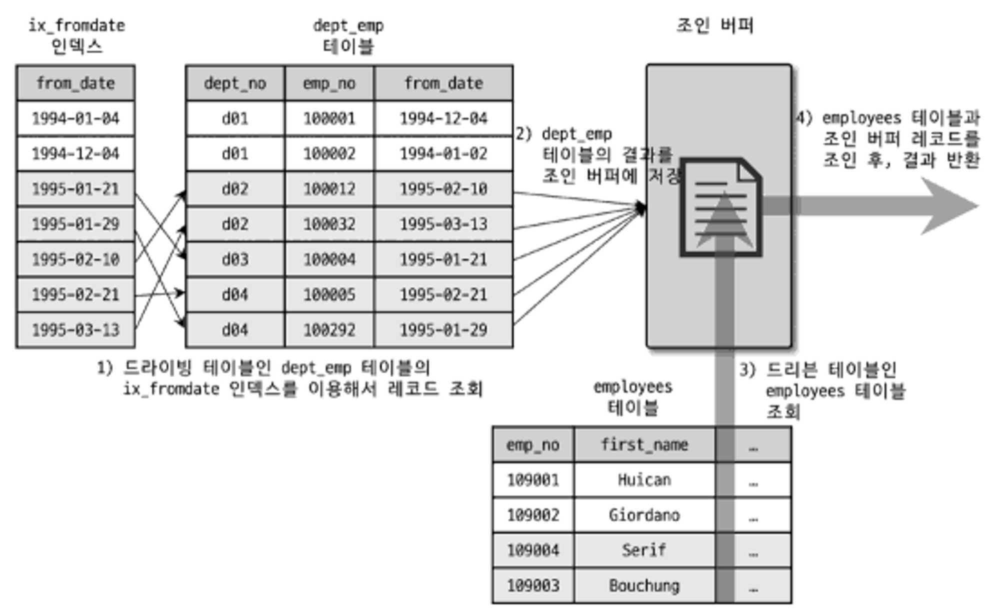
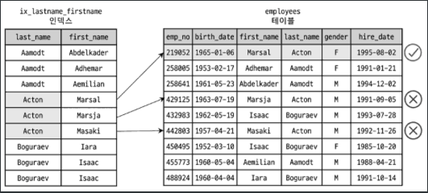
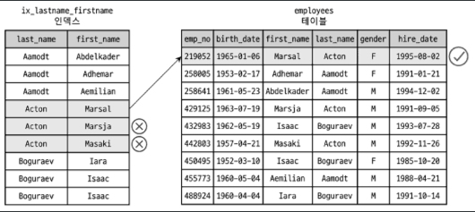

# 09.옵티마이저와 힌트

</br>

## 9.1 개요
- 쿼리의 실행계획을 수립하는 옵티마이저는 가장 중요한 부분
- 옵티마이저를 이해하기 위해 실행 계획부터 이해하라
- MySQL에서 실행계획 명령어는 `EXPLAIN`

### 9.1.1 쿼리 실행 절차
- 쿼리 실행 과정 3단계
    1. **SQL파싱**: 사용자로부터 요청된 SQL 문장을 잘게 쪼개서 MySQL 서버가 이해할 수 있는 수준으로 분리(파스 트리) > SQL 파서 모듈로 처리
    1. **최적화 및 실행 계획 수립**: SQL의 파싱 정보(파스 트리)를 확인하면서 어떤 테이블부터 읽고 어떤 인덱스를 이용해 테이블을 읽을지 선택 > 옵티마이저가 처리
        - **쿼리변환**: 불필요한 조건 제거 및 복잡한 연산의 단순화
        - **조인 순서 결정**: 여러 테이블의 조인이 있는 경우 어떤 순서로 테이블을 읽을지 결정
        - **사용 인덱스 결정**: 각 테이블에 사용된 조건과 인덱스 통계 정보를 이용해 사용할 인덱스 결정
        - **집계**: 가져온 레코드들을 임시 테이블에 넣고 다시 한 번 가공해야 하는지 결정
    1. **SQL실행**: 두 번째 단계에서 결정된 테이블의 읽기 순서나 선택된 인덱스를 이용해 스토리지 엔진으로부터 데이터를 가져옴

### 9.1.2 옵티마이저의 종류
- 옵티마이저는 DB서버에서 두뇌 역할
- 최적화 규칙
    - 규칙 기반 최적화(Rule-based optimizer,RBO)
        - 기본적으로 대상 테이블의 레코드 건수나 선택도 등을 고려하지 않고, 내장된 우선순위에 따라 실행 계획을 수립하는 방식
        - 같은 쿼리에 대해서 거의 항상 같은 실행 방법을 생성
        - 옛날 방식이고, 요즘 거의 사용하지 않음
    - **비용 기반 최적화(Cost-based optimizer,CBO)**
        - 쿼리를 처리하기 위한 여러 가지 가능한 방법을 만들고, 각 단위 작업의 비용(부하) 정보와 대상 테이블의 예측된 통계 정보를 이용해 실행 계획별 비용을 산출
        - 산출된 실행 방법별로 비용이 가장 낮은 처리 방식을 선택해 쿼리를 실행

</br>

## 9.2 기본 데이터 처리

### 9.2.1 풀 테이블 스캔과 풀 인덱스 스캔
- 풀 테이블 스캔을 선택하는 조건
    - 테이블의 레코드 건수가 너무 작은 경우
    - WHERE 또는 ON 절에 적절한 조건 컬럼이 없는 경우
    - 인덱스 레인지 스캔 범위가 너무 큰 경우
- **Read Ahead**란, 어떤 영역의 데이터가 앞으로 필요할 것이라 예측해서 요청오기 전에 미리 디스크에서 읽어 버퍼풀에 가져다 두는 것을 의미
    - 풀 테이블 스캔이 실행되면 처음 몇 개의 데이터 페이지는 Foreground thread(클라이언트 스레드)가 페이지 읽기를 실행하지만 특정 시점부터는 읽기 작업을 background thread로 넘김
    - background thread가 읽기를 넘겨받는 시점부터는 한 번에 4개 또는 8개씩의 페이지를 읽으면서 계속 그 수를 증가 시킴
    - 이때 한 번에 최대 64개의 데이터 페이지까지 읽어서 버퍼 풀에 저장해 둠
        - `innodb_read_ahead_ghreshold` 시스템 변수로 Read Ahead 임계값 설정
- Read Ahead는 풀 테이블 스캔에서만 사용되는 것이 아니라 풀 인덱스 스캔에서도 동일하게 사용됨

### 9.2.2 병렬 처리
- 병렬 처리란, 하나의 쿼리를 여러 스레드가 작업을 나누어 동시에 처리한다는 것을 의미
- 서버에 장착된 CPU의 코어 수보다 병렬 처리용 스레드 수가 많아지면 성능 떨어질 수 있음
- 병렬 스레드 수는 `innodb_parallel_read_threads` 시스템 변수를 변경하여 설정
    - ex)
    ```sql
    SET SESSION innodb_parallel_read_threads=1;
    SELECT COUNT(*) FROM salaries;
    1 row in set (0.32 sec)

    SET SESSION innodb_parallel_read_threads=4;
    SELECT COUNT(*) FROM salaries;
    1 row in set (0.18 sec)

    SET SESSION innodb_parallel_read_threads=8;
    SELECT COUNT(*) FROM salaries;
    1 row in set (0.13 sec)
    ```

### 9.2.3 ORDER BY 처리(Using filesort)
- 정렬 처리 방법
    |  | 장점 | 단점 |
    | --- | --- | --- |
    | 인덱스 이용 | `INSERT`,`UPDATE`,`DELETE` 쿼리가 실행될 때 이미 인덱스가 정렬돼 있어서 순서대로 읽기만 하면 되므로 매우 빠름 | `INSERT`,`UPDATE`,`DELETE` 작업 시 부가적인 인덱스 추가/삭제 작업이 필요하므로 느림. </br> 인덱스 때문에 디스크 공간이 더 많이 필요. </br> 인덱스의 개수가 늘어날수록 InnoDB의 버퍼 풀을 위한 메모리가 많이 필요 |
    | Filesort 이용 | 인덱스를 생성하지 않아도 되므로 인덱스를 이용할 때 단점이 장점으로 바뀜.</br> 정렬해야 할 레코드가 많지 않으면 메모리에서 Filesort가 처리되므로 충분히 빠름 | 정렬 작업이 쿼리 실행 시 처리되므로 레코드 수 많아질수록 쿼리 응답 속도가 느림 |

- 사실상 인덱스는 이미 정렬되어 저장되기 때문에, 별도 정렬 연산 비용이 들지 않음
- 인덱스로 정렬 연산 생략이 불가능한 경우
    - 정렬 기준이 너무 많아서 요건별로 모두 인덱스 생성이 불가능한 경우
    - `GROUP BY`의 결과 또는 `DISTINCT` 같은 처리의 결과를 정렬해야 하는 경우
    - `UNION` 처럼 임시 테이블의 결과를 다시 정렬해야 하는 경우
    - 랜덤하게 결과 레코드를 가져와야 하는 경우
- 실행 계획의 `Extra` 컬럼에 'Using Filesort' 메시지가 표시되었으면 Filesort 이용해 정렬되었다는 의미

#### 9.2.3.1 소트 버퍼
- **소트 버퍼는 MySQL에서 (filesort)정렬을 수행하기 위해 할당받는 별도의 메모리 공간**
    - 소트 버퍼를 위한 메모리 공간은 쿼리 실행이 완료되면 즉시 시스템으로 반납됨
- 소트 버퍼 할당 용량이 커지면 운영체제는 메모리 부족으로 인해 MySQL 프로세스를 강제 종료 (ex.10 MB이상)
    - 정렬을 위해 할당하는 소트 버퍼는 세션 메모리 영역에 해당됨
    - 최대 사용가능한 소트 버퍼의 공간은 `sort_buffer_size`라는 시스템 변수로 설정할 수 있음
    - OLTP용 MySQL 서버의 적정 소트 버퍼 크기는 56 KB ~ 1MB (저자 경험상)
    - 소트 버퍼를 크게 설정해서 빠른 성능을 얻을 수는 없지만 디스크의 읽기와 쓰기 사용량은 줄일 수 있음
- 정렬해야 할 레코드의 건수가 소트 버퍼로 할당된 공간보다 큰 경우 
    - 메모리의 소트 버퍼에서 정렬을 수행하고, 그 결과를 임시로 디스크에 기록해 둠
    - 다음 레코드를 가져와서 다시 정렬해서 반복적으로 디스크에 임시 저장
    - 각 버퍼 크기만큼 정렬된 레코드를 다시 병합하면서 정렬을 수행해야 함

#### 9.2.3.2 정렬 알고리즘
- **싱글 패스 정렬 방식**: 정렬 대상 크기나 건수가 작은 경우 빠른 성능을 보임
    - SELECT 대상이 되는 컬럼 전부를 담아서 정렬을 수행
    - 정렬이 완료되면 정렬 버퍼의 내용을 그대로 클라이언트에게 넘겨줌
    - 최신 버전에서 일반적으로 사용되는 방식
- **투 패스 정렬 방식**: 정렬 대상 크기나 건수가 상당히 많은 경우 효율적
    - 정렬 대상 컬럼과 PK값만 소트 버퍼에 담아서 정렬을 수행하고, 정렬된 순서대로 다시 PK로 테이블을 읽어서 SELECT할 컬럼을 가져오는 정렬 방식
    - 테이블을 두 번 읽어야 함
    - 싱글 패스 정렬 방식이 도입되기 이전부터 사용되던 방식
    - 투 패스 사용하는 경우
        - 레코드의 크기가 max_length_for_sort_data 시스템 변수에 설정된 값보다 클 때
        - BLOB이나 TEXT 타입의 컬럼이 SELECT 대상에 포함할 때

#### 9.2.3.3 정렬 처리 방법
- ORDER BY가 사용되면 반드시 3가지 처리 방법으로 정렬 처리됨
    | 정렬 처리 방법 | 실행 계획의 Extra 컬럼 내용 |
    | --- | --- |
    | 인덱스를 사용한 정렬 | 별도 표기 없음 |
    | 조인에서 드라이빙 테이블만 정렬 | "Using filesort" 메시지가 표시됨 |
    | 조인에서 조인 결과를 임시 테이블로 저장 후 정렬 | "Using temporary; Using filesort" 메시지가 표시됨 |

- 먼저 옵티마이저는 정렬 처리를 위해 인덱스를 이용할 수 있을지 검토하고, 인덱스 이용 가능하면 별도의 "Filesort" 과정 없이 인덱스를 순서대로 읽어서 결과를 반환함
- 하지만 인덱스를 사용할 수 없다면 WHERE 조건에 일치하는 레코드를 검색해 정렬 버퍼에 저장하면서 정렬을 처리(Filesort)할 것임
- 옵티마이저는 정렬 대상 레코드를 최소화하기 위해 2가지 방법 중 하나를 선택함
    - 조인의 드라이빙 테이블만 정렬한 다음 조인을 수행
    - 조인이 끝나고 일치하는 레코드를 모두 가져온 후 정렬을 수행

##### 9.2.3.3.1 인덱스를 이용한 정렬
- 인덱스를 이용한 정렬을 위해서는 반드시 ORDER BY에 명시된 컬럼이 드라이빙 테이블에 속하고, ORDER BY 순서대로 생성된 인덱스가 있어야 함
- 또한 WHERE 절에 첫 번쨰로 읽는 테이블의 컬럼에 대한 조건이 있다면 그 조건과 ORDER BY는 같은 인덱스를 사용할 수 있어야 함

##### 9.2.3.3.2 조인의 드라이빙 테이블만 정렬
- 이 방식으로 정렬이 처리되려면 드라이빙 테이블의 컬럼만으로 ORDER BY절을 작성해야 함

##### 9.2.3.3.3 임시 테이블을 이용한 정렬
- 조인의 결과를 임시 테이블에 저장하고, 그 결과를 다시 정렬
- 2개 이상의 테이블을 조인해서 정렬하는 경우엔 임시 테이블이 필요할 수도 있음
- 3가지 정렬 방법 중 정렬해야 할 레코드 수가 가장 많기 때문에 가장 느린 정렬 방법

##### 9.2.3.3.4 정렬 처리 방법의 성능 비교
- 스트리밍 방식
    - 쿼리가 얼마나 많은 레코드를 조회하느냐에 상관없이 빠른 응답 시간을 보장해줌
    - limit처럼 결과 건수 줄여주는 조건들을 사용하면 시간을 상당히 줄여줄 수 있음
- 버퍼링 방식
    - ORDER BY, GROUP BY 같은 처리는 쿼리의 결과가 스트리밍 되는 것을 불가능하게 함

#### 9.2.3.4 정렬 관련 상태 변수
- 몇 건의 레코드나 정렬 처리를 수행했는지, 소트 버퍼 간의 병합 작업(멀티 머지)은 몇 번이나 발생했는지 등 조회하는 명령어

```
mysql> FLUSH STATUS;
mysql> SHOW STATUS LIKE 'Sort%';

+--------------------------+--------+
| Variable_name            | Value  |
+--------------------------+--------+
| Sort_merge_passes        | 13     |
| Sort_range               | 0      |
| Sort_rows                | 300024 |
| Sort_scan                | 1      |
+--------------------------+--------+
```

- Sort_merge_passes는 멀티 머지처리 횟수를 의미
- Sort_range는 인덱스 레인지 스캔을 통해 검색된 결과에 대한 정렬 작업 누적 횟수
- Sort_scan은 풀 테이블 스캔을 통해 검색된 결과에 대한 정렬 작업 누적 횟수
- Sort_rows는 지금까지 정렬한 전체 레코드 건수를 의미


## 참고) 조인 테이블별 인덱스 컬럼 구성 순서
- 드라이빙 테이블 (ON절 컬럼은 인덱스 구성하지 않아도 됨)
    1. '='조건
    1. 정렬 생략 가능하다면 ORDER BY 명시 컬럼
    1. 범위 조건

- 드리븐 테이블 (1,2번 순서 바뀌어도 됨)
    1. ON절 컬럼
    1. '='조건
    1. 범위 조건

## 9.2.4 GROUP BY 처리
- GROUP BY 또한 ORDER BY와 같이 쿼리가 스트리밍된 처리를 할 수 없게 하는 처리 중 하나    
- GROUP BY에 사용된 조건은 인덱스를 사용해서 처리될 수 없으므로 HAVING절을 튜닝하려고 인덱스를 생성하거나 다른 방법을 고민할 필요 없음
- GROUP BY 작업도 인덱스를 탈 수도 못 탈수도 있음
    - 인덱스 타는 경우
        - 인덱스 차례대로 읽는 스캔 방법 (=인덱스 레인지 스캔)
        - 인덱스를 건너뛰면서 읽는 루스 인덱스 스캔 방법
    - 인덱스 타지 못하면 임시 테이블을 사용함
- **핵심은 GROUP BY 집계 시 인덱스로 정렬(Filesort)을 생략할 수 있냐?없냐?**

#### 9.2.4.1 인덱스 스캔을 이용하는 GROUP BY(타이트 인덱스 스캔)
- 조인 시 드라이빙 테이블 컬럼으로만 집계하는 경우, 미리 생성된 인덱스로 정렬 연산을 생략할 수 있음

#### 9.2.4.2 루스 인덱스 스캔을 이용하는 GROUP BY
- 루스 인덱스 스캔하는 경우, 실행 계획의 Extra 컬럼의 "Using Index for group-by" 코멘트가 표시됨
- 루스 인덱스 스캔 사용 조건
    - 단일 테이블에 대해 수행되는 GROUP BY 처리에만 사용 가능
        - where 조건절에 인덱스 후행 컬럼만 존재, 인덱스 선두 컬럼은 GROUP BY 절에 존재하는 경우
    - 집계 함수 MIN,MAX 일때만 사용 가능
    - GROUP BY 사용된 컬럼이 인덱스 구성 컬럼 선행 컬럼들로 구성되어야 함
    - SELECT절 컬럼과 GROUP BY 컬럼과 일치해야 함
- 인덱스의 유니크한 값의 수가 적을수록 성능이 향상됨 
    - 분포도가 좋지 않은 인덱스일수록 더 빠른 결과를 만들어 냄
    - 그래도 무조건 인덱스 레인지 스캔 타는게 성능측면에서 제일 좋음
- 루스 인덱스 스캔 사용 가능/불가능 쿼리문 예시
    - 생성된 인덱스 idx1: (col1, col2, col3)
        | col1 | col2 | col3 |
        |---|---|---|
        |1|1|1|
        |1|1|2|
        |1|1|3|
        |1|2|1|
        |1|2|2|
        |1|2|3|
        |1|3|1|
        |1|3|2|
        |1|3|3|
        |2|1|1|
        |2|1|2|
        |..|..|..|
    ```sql
    SELECT col1, col2 FROM tb_test GROUP BY col1, col2;
    SELECT DISTINCT col1,col2 FROM tb_test;
    SELECT col1, MIN(col2) FROM tb_test GROUP BY col1;
    SELECT col1, col2 FROM tb_test WHERE col1 < const GROUP BY col1, col2;
    SELECT MAX(col3), MIN(col3), col1, col2 FROM tb_test WHERE col2 > const GROUP BY col1, col2;
    SELECT col2 FROM tb_test WHERE col1 < const> GROUP BY col1, col2;
    SELECT col1, col2 FROM tb_test WHERE col3 = const GROUP BY col1, col2;
    SELECT col1, SUM(col2) FROM tb_test GROUP BY col1;
    SELECT col1, col2 FROM tb_test GROUP BY col2, col3;
    SELECT col1, col3 FROM tb_test GROUP BY col1, col2;
    ```

#### 9.2.4.3 임시 테이블을 사용하는 GROUP BY
- 인덱스를 사용하지 못하는 경우 이 방식으로 처리됨
- 실행계획의 Extra 컬럼의 "Using temporary" 메시지가 표시됨
- 8.0 부터는 내부적으로 GROUP BY절의 컬럼들로 구성된 유니크 인덱스를 가진 임시 테이블을 만들어서 중복 제거와 집합 함수 연산을 수행

### 9.2.5 DINSTINCT 처리
- 집계 함수 없이 사용하는 경우
- MIN,MAX,COUNT 같은 집계 합수와 함께 사용하는 경우

#### 9.2.5.1 SELECT DISTINCT ...
- 8.0 부터는 GROUP BY 수행하는 쿼리에 ORDER BY절이 없으면 정렬을 사용하지 않아서 DISTINCT와 GROUP BY 연산은 내부적으로 같은 작업을 수행함

#### 9.2.5.2 집합 함수와 함께 사용된 DISTINCT
- 진합 함수 내에서 사용된 DISTINCT는 그 집합 함수의 인자로 전달된 컬럼값이 유니크한 것들을 가져옴
- 내부적으로 임시테이블을 사용하지만, 실행 계획에선 "Using temporary"를 표시하지 않음

### 9.2.6 내부 임시 테이블 활용
- 내부적인 임시 테이블은 쿼리 처리가 완료되면 자동으로 삭제됨
- 사용자가 `CREATE TEMPORARY TABLE`구문으로 생성하는 임시 테이블과는 다른 개념

#### 9.2.6.1 메모리 임시 테이블과 디스크 임시 테이블
- 8.0 버전부터 메모리는 TeampTable 엔진을 사용하고, 디스크에 저장되는 임시 테이블은 InnoDB 엔진을 사용하도록 개선됨
    - 이전 버전의 메모리 임시 테이블은 MEMORY 엔진을 사용
    - MEMORY 엔진은 VARBINARY나 VARCHAR 같은 가변 길이 타입을 지원하지 못해서 가변길이 최대 길이만큼 메모리를 할당해야하는 문제점이 있음
- 임시테이블의 크기가 1GB보다 커지면 디스크로 기록하게 되는데, 2가지 디스크 저장 방식 중 하나를 선택
    - MMAP 파일로 디스크에 기록 (default)
    - InnoDB 테이블로 기록
- 하지만 처음부터 메모리에 생성되지 않고, 디스크에 생성될 경우 InnoDB 테이블로 기록됨

#### 9.2.6.2 임시 테이블이 필요한 쿼리
- 대표적으로 내부 임시 테이블을 생성하는 케이스
    - ORDER BY와 GROUP BY에 명시된 컬럼이 다른 쿼리
    - ORDER BY나 GROUP BY에 명시된 컬럼이 조인의 순서상 첫 번째 테이블(드라이빙 테이블)이 아닌 쿼리
    - DISTINCT와 ORDER BY가 동시에 쿼리에 존재하는 경우 또는 DISTINCT가 인덱스로 처리되지 못하는 쿼리
    - UNION이나 UNION DISINTCT가 사용된 쿼리(select type 컬럼이 UNION RESULT인 경우)
    - 쿼리의 실행 계획에서 select_type이 DERIVED인 쿼리
- 마지막 3가지 케이스는 내부적으로 임시 테이블을 사용해도 실행계획 상 "Using temporary"가 표시되지 않음
- 마지막 케이스의 경우 유니크 인덱스가 없는 내부 임시 테이블이 생성됨 

#### 9.2.6.3 임시 테이블이 디스크에 생성되는 경우
- 디스크 기반의 임시 테이블을 사용하는 경우
    - UNION이나 UNION ALL에서 SELECT 컬럼 중 길이가 512 Byte 이상인 크기의 컬럼이 있는 경우
    - GROUP BY나 DISTINCT 컬럼에서 512 Byte 이상인 크기의 컬럼이 있는 경우
    - 메모리 임시 테이블의 크기가 (MEMORY 스토리지 엔진에서) `tmp_table_size` 또는 `max_heap_table_size` 시스템 변수보다 크거나(TempTable 스토리지 엔진에서) `temptable_max_ram` 시스템 변수 값보다 큰 경우
- 참고) 8.0.13 버전부터 BLOB이나 TEXT 컬럼을 가진 임시 테이블도 메모리에 생성 가능

#### 9.2.6.4 임시 테이블 관련 상태 변수
- 실행 계획상 "Using temporary"라고 표시돼도 메모리/디스크 중 어디에 생성된건지 알 수 없음
- 임시 테이블 메모리/디스크 중 생성된 위치 확인하는 쿼리문
    ```sql
    SHOW SESSION STATUS LIKE 'Created_tmp%';
    +-------------------------+--------+
    | Variable nabe           | VALUE  |
    +-------------------------+--------+
    | Created_tmp_disk_tables |     1  |
    | Created_tmp_tables      |     1  |
    +-------------------------+--------+
    ```


## 9.3 고급 최적화

- 옵티마이저가 실행 계획을 수립할 때 통계 정보와 옵티마이저 옵션을 결합해서 최적화 실행 계획을 수립함
- 옵티마이저 옵션
    - 조인 관련 옵티마이저 옵션
    - 옵티마이저 스위치
- 이들은 고급 최적화 기능들을 활성화할지를 제어하는 용도로 사용됨

### 9.3.1 옵티마이저 스위치 옵션
- 스위치 옵션은 `optimizer_switch` 시스템 변수를 여러 옵션을 세트로 묶어서 설정하는 방식으로 사용함
- 아래와 같이 스위치 옵션을 사용할 것인지 여부를 on/off 형태로 설정

| 옵티마이저 스위치명 | 기본값 | 설명 |
|-|-|-|
|batched_key_access|off|BKA 조인 알고리즘을 사용할지 여부 설정|
|block_nested_loop|on|Block Nested Loop 조인 알고리즘을 사용할지 여부 설정|
|engine_condition_pushdown|on|Engine Condition Pushdown 기능을 사용할지 여부 설정|
|index_condition_pushdown|on|Index Condition Pushdown 기능을 사용할지 여부 설정|
|use_index_extensions|on|Index Extension 최적화를 사용할지 여부 설정|
|...|...|~~~ 최적화를 사용할지 여부 설정|


#### 9.3.1.1 MRR과 배치 키 액세스(mrr & batched_key_access)
- MRR(Multi-Range Read)이란?
    - 드라이밍 테이블의 레코드를 읽어서 드리븐 테이블과의 조인을 즉시 실행하지 않고 조인 대상을 버퍼링 함
    - 조인 버퍼에 레코드가 가득 차면 비로소 MySQL 엔진은 버퍼링된 레코드를 스토리지 엔진으로 한 번에 요청 함
        - MySQL 서버의 내부 구조상 조인 처리는 MySQL 엔진이 처리하고, **실제 레코드를 검색하고 읽는 부분은 스토리지 엔진이 담당**
    - 이렇게 함으로써 스토리지 엔진은 읽어야 할 레코드들을 데이터 페이지에 정렬된 순서로 접근해 디스크의 데이터를 페이지 읽기를 최소화 할 수 있는 것

- MRR을 이용해 실행되는 조인 방식을 BKA 조인이라 함
    - BKA 조인 최적화는 기본적으로 비활성화돼 있음
    - 쿼리 특성에 따라 BKA 조인이 도움되는 경우도 있지만, 부가적인 정렬 작업이 필요해지면서 오히려 성능에 안좋은 영향을 미치는 경우가 있음

- 참고) 기본적으로 지원하는 조인 방식은 NL(NestedLoop)방식으로 드라이빙 테이블의 레코드를 한 건 읽어서 드리븐 테이블의 일치하는 레코드를 찾아서 조인을 수행함
    - 드라이빙 테이블 - 조인에서 제일 먼저 읽는 테이블
    - 드리븐 테이블 - 조인되는 테이블에서 드라이빙이 아닌 테이블들  

#### 9.3.1.2 블록 네스티드 루프 조인(block_nested_loop)
- 8.0.20 버전 부터는 해시 조인 알고리즘이 대체되어 사용되기 떄문에, BNL조인이 뭔지만 알고 넘어가면 됨
- **BNL(Block Nested Loop)조인 = 조인 버퍼를 사용한 조인**
    - 조인 알고리즘에서 "Block"이란 단어가 사용되면 조인용 버퍼가 사용됐다는 것을 의미함
    - 실행 계획에서 Extra 컬럼에 "Using Join buffer"라는 문구가 표시되면 조인 버퍼를 사용한다는 의미
    - 조인 버퍼가 사용되는 쿼리에선 조인 순서가 거꾸로인 것처럼 실행됨
- 조인 시 드리븐 테이블의 풀 테이블 스캔 또는 인덱스 풀 스캔을 피할 수 없으면 드라이빙 테이블에서 읽은 레코드를 메모리에 캐시한 후 드리븐 테이블과 조인하는 형태로 처리함
    - 이때 사용되는 메모리 캐시를 조인 버퍼라고 하고, `join_buffer_size`라는 시스템 변수로 크기를 제한할 수 있음
    - 조인 완료 시 조인 버퍼는 바로 해제됨

- 예시
    - 쿼리문
        ```sql
        SELECT *
        FROM employees e
        INNER JOIN salaries s ON s.emp_no = e.emp_no
                    AND s.from_date<=NOW()
                    AND s.todate>=NOW()
        WHERE e.forst_name='Amor';
        ```
    - 조인 버퍼를 사용하는 조인(Block Nested Loop)
        
        1. `dept_emp` 테이블의 `ix_fromdate` 인덱스를 이용해 조건을 만족하는 레코드를 검색
        1. 조인에 필요한 나머지 컬럼을 모두 `dept_emp` 테이블로부터 읽어서 조인 버퍼에 저장
        1. `employees` 테이블의 PK를 이용해 조건을 만족하는 레코드를 검색
        1. 3번에서 검색된 결과(employees)에 2번의 캐치된 조인 버퍼의 레코드(dept_emp)를 결합해서 반환함

#### 9.3.1.3 인덱스 컨디션 푸시다운(index_condition_pushdown)
- 인덱스 컨디션 푸시다운이란, 인덱스 컬럼이 체크조건으로 사용됐을 때 인덱스 스캔 후 조건에 부합하지 않는 레코드들은 필터링하여 테이블 읽기를 수행하지 않게 해주는 기능
    - 체크조건(또는 필터링조건)이란 데이터를 모두 읽은 후 사용자가 원하는 결과인지 하나씩 비교해보는 조건
- 무조건 켜는게 유리한 기능
- 실행계획 상 "Using where"가 표시됐으면 인덱스 컨디션 푸시다운이 활성화되지 않았음을 의미함

- 인덱스 컨디션 푸시다운 예제
    - 생성된 인덱스 ix_lastname_firstname: last_name,first_name 
    ```sql
    SELECT * FROM employees WHERE last_name=’Action’ AND first_name LIKE ‘%sal’;
    ``` 
    - last_name=’Action’은 ix_lastname_firstname을 인덱스 레인지 스캔으로 사용할 수 있지만, first_name LIKE ‘%sal’ 는 체크조건으로 사용함
    - 인덱스 컨디션 푸시다운을 껐을때
    
    - 인덱스 컨디션 푸시다운을 켰을때
    

#### 9.3.1.4 인덱스 확장(use_index_extensions)
- `use_index_extensions` 옵티마이저 옵션은 InnoDB 스토리지 엔진을 사용하는 테이블에서 세컨더리 인덱스에 자동으로 추가된 PK를 활용여부를 결정하는 옵션
- 세컨더리 인덱스 예제
    - PK,세컨더리 인덱스를 갖는 테이블
        ```sql
        CREATE TABLE dept_emp(
            emp_no INT NOT NULL,
            dept_no CHAR(4) NOT NULL,
            from_date DATE NOT NULL,
            to_date DATE NOT NULL,
            PRIMARY KEY(dept_no,emp_no),
            KEY ix_fromdate(from_date)
        ) ENGINE=InnoDB;
        ```
    - 세컨더리 인덱스로 레코드를 찾아가기 위해서 PK인 dept_no, emp_no 컬럼을 순서대로 포함하여, (from_date, dept_no, emp_no)의 조합인 인덱스를 생성한 것과 흡사하게 작동할 수 있음
        - 세컨더리 인덱스를 타면 정렬 연산(Filesort) 생략 가능해짐
        ```sql
        SELECT * FROM dept_emp WHERE from_date= '1987-07-25' ORDER BY dept_no;
        ```
- 예전 MySQL 버전에서는 세컨더리 인덱스의 마지막에 자동 추가되는 PK를 제대로 활용하지 못했음
- 서버가 업그레이드 되면서 옵티마이저는 ix_fromdate 인덱스 마지막에 (dept_no,emp_no) 컬럼이 숨어있다는 것을 인지하고 실행 계획을 수립하도록 개선됨

#### 9.3.1.5 인덱스 머지(index_merge)
- 하나의 테이블에 대해 2개 이상의 인덱스를 이용해 쿼리를 처리할 수 있는 옵티마이저 옵션
- 인덱스 머지 실행 계획을 사용하는 경우
    -> 쿼리에 사용된 각각의 조건이 서로 다른 인덱스를 사용할 수 있고, 그 조건을 만족하는 레코드 건수가 많을 것으로 예상될 떄
- 인덱스 머지 실행 계획을 3개의 세부 실행 계획으로 나눌 수 있음
    - `index_merge_intersection`
    - `index_merge_sort_union`
    - `index_merge_union`
- 3개의 최적화 옵션을 한 번에 모두 제어할 수 있는 옵션이며, 각각의 최적화 알고리즘에 대해서는 하나씩 예제로 살펴보자

#### 9.3.1.6 인덱스 머지 - 교집합(index_merge_intersection)
- 실행 계획의 Extra 컬럼에 "Using intersect"라고 표시됨
    - 여러 개의 인덱스를 각각 검색해서 그 결과의 교집합만 반환했다는 것을 의미함
- 인덱스 머지 - 교집합 예제
    - 쿼리문
        ```sql
        EXPLAIN SELECT *
        FROM employees
        WHERE first_name='Georgi' AND emp_no BETWEEN 10000 AND 20000;
        ```
    - 실행 계획
        ```
        +-------------+-----------------------+---------+----------------------------------------------------+
        | type        | key                   | key_len | Extra                                              |
        +-------------+-----------------------+---------+----------------------------------------------------+
        | index_merge | ix_firstname, PRIMARY | 62,4    | Using intersect(ix_firstname,PRIMARY); Using where |
        +-------------+-----------------------+---------+----------------------------------------------------+
        ```
    - 두 조건을 만족하는 레코드 건수는 14건 밖에 안되지만, 각각 조건을 일치하는 건수는 253건, 10000건임
        -> 각각 인덱스 스캔을 할 경우 인덱스 스캔 비효율 발생
    - 이런 경우 인덱스 머지 교집합을 활성화하여 최적화시키는 것이 효율적

#### 9.3.1.7 인덱스 머지 - 합집합(index_merge_union)
- 인덱스 머지의 "Using union"은 WHERE절에 사용된 **2개 이상의 조건이 각각의 인덱스를 사용하되 OR 연산자로 연결된 경우** 사용되는 최적화
- 실행 계획의 Extra 컬럼에 "Using union"라고 표시됨
- 인덱스 머지 - 합집합 예제
    - 쿼리문
        ```sql
        SELECT *
        FROM employees
        WHERE first_name='Matt' OR hire_date ='1987-03-31';
        ```
    - 실행 계획
        ```
        +-------------+---------------------------+---------+------------------------------------------+
        | type        | key                       | key_len | Extra                                    |
        +-------------+---------------------------+---------+------------------------------------------+
        | index_merge | ix_firstname, ix_hiredate | 58,3    | Using union(ix_firstname,ix_hiredate);   |
        +-------------+---------------------------+---------+------------------------------------------+
        ```
    - Extra에 출력된 문구는 ix_firstname와 ix_hiredate의 인덱스 검색 결과를 'Union' 알고리즘으로 병합했다는 것을 의미
- 병합 후 중복 제거는 어떻게 할까?
    - 각각 인덱스 검색 결과는 PK로 이미 정렬돼 있음
    - MySQL 서버는 두 집합에서 하나씩 가져와서 서로 비교하며 값이 중복된 레코드들을 정렬 없이 걸러낼 수 있음

#### 9.3.1.8 인덱스 머지 - 정렬 후 합집합(index_merge_sort_union)
- 인덱스 머지 작업을 하는 도중에 결과의 정렬이 필요한 경우 MySQL 서버는 인덱스 머지 최적화의 'Sort union' 알고리즘을 사용
- OR 조건 중 하나 이상이 범위 조건(<=, >=, BETWEEN 등)인 경우 PK로 정렬돼있지 않아 별도 정렬 연산이 필요함
- 예제
    ```sql
    SELECT *
    FROM employees
    WHERE first_name='Matt'
        OR hire_date BETWEEN '1987-03-01' AND '1987-03-31'
    ```

#### 9.3.1.9 세미 조인(semijoin)
- 세미 조인이란? 실제 조인을 수행하지는 않고, 다른 테이블에서 조건에 일치하는 레코드가 있는지 없는지만 체크하는 최적화 방식
- 세미조인이 비활성화되는 경우 예제
    - 쿼리문
        ```sql
        SELECT *
        FROM employees e
        WHERE e.emp_no IN
            (SELECT de.emp_no FROM dept_emp de WHERE de.from_date='1995-01-01');
        ```
    - 실행 계획
        ```
        +-----+-------------+--------+------+-------------+---------+
        | id  | select_type | table  | type | key         | rows    |
        +-----+-------------+--------+------+-------------+---------+
        | 1   | PRIMARY     | e      | ALL  | NULL        | 300363  |
        | 2   | SUBQUERY    | de     | ref  | ix_fromdate | 57      |
        +-----+-------------+--------+------+-------------+---------+
        ```
    - MySQL서버는 employees 테이블을 풀 스캔하면서 서브쿼리 결과인 57건과 일치하는 지 30만건 넘게 읽는 비효율 발생
- '='(subquery) 형태와 'IN'(subquery) 형태의 세미 조인 쿼리에 대한 3가지 최적화 방법
    - 세미 조인 최적화
    - IN-to_EXISTS 최적화
    - MATERIALIZATION 최적화
- 세미 조인 최적화 5가지 전략
    - Table Pull-out
    - Duplicate Weed-out
    - First Match
    - Loose Scan
    - Materialization

#### 9.3.1.10 테이블 풀-아웃(Table Pull-out)
- 세미 조인의 서브쿼리에 사용된 테이블을 아우터 쿼리 변환하여 조인 구문 실행하는 최적화 방식
- 풀-아웃이 가장 빈번하게 사용되는 케이스는 IN(subquery) 형태의 세미 조인 테이블
- Table pullout 최적화의 몇 가지 제한 사항과 특성
    - Table pullout 최적화는 세미 조인 서브쿼리에서만 사용 가능함
    - Table pullout 최적화는 서브쿼리 부분이 UNIQUE 인덱스나 PK 룩업으로 결과가 1건인 경우에는 사용 가능함
    - Table pullout이 적용된다고 하더라도 기존 쿼리에서 가능했던 최적화 방법이 사용 불가능한 것은 아니므로 MySQL에서는 가능하다면 Table pullout 최적화를 최대한 적용함
    - Table pullout 최적화는 서브쿼리의 테이블을 아우터 쿼리로 가져와서 조인으로 풀어쓰는 최적화를 수행하는데, 만약 서브쿼리의 모든 테이블이 아우터 쿼리로 끄집어 낼 수 있다면 서브쿼리 자체는 없어짐
    - MySQL에서는 "최대한 서브쿼리를 조인으로 풀어서 사용해라"라는 튜닝 가이드가 많은데, Table pullout 최적화는 사실 이 가이드를 그대로 실행하는 것임. 이제부터는 서브쿼리를 조인으로 풀어서 사용할 필요가 없음
- 테이블 풀 아웃 최적화 예제
    - 쿼리문
        ```sql
        EXPLAIN SELECT * FROM employees e 
        WHERE e.emp_no IN (
                            SELECT de.emp_no FROM dept_emp de
                            WHERE de.dept_no='d009'
                            );
        ```
    - 실행 계획
        ```
        +-----+-------------+--------+--------+-------------+--------+--------------+
        | id  | select_type | table  | type   | key         | rows   | Extra        |
        +-----+-------------+--------+--------+-------------+--------+--------------+
        | 1   | SIMPLE      | e      | ref    | PRIMARY     | 46012  | Using index; |
        | 1   | SIMPLE      | de     | eq_ref | PRIMARY     | 1      | NULL         |
        +-----+-------------+--------+--------+-------------+--------+--------------+
        ```
        - 가장 중요한 부분은 id 컬럼의 값이 모두 1이라는 것인데, 두 테이블이 서브쿼리 형태가 아니라 조인으로 처리했음을 의미함

#### 9.3.1.11 퍼스트 매치(firstmatch)
- IN(subquery) 형태의 세미 조인을 EXISTS(subquery) 형태로 튜닝한 것과 비슷한 방법으로 실행됨
- 퍼스트 매치 최적화 예제
    - 쿼리문
        ```sql
        EXPLAIN SELECT *
        FROM employees e 
        WHERE e.first_name='Matt'
            AND e.emp_no IN (
                            SELECT t.emp_no FROM titles t
                            WHERE t.from_date BETWEEN '1995-01-01' AND '1995-01-30'
                            );
        ```
    - 실행 계획
        ```
        +-----+-------+------+--------------+------+-----------------------------------------+
        | id  | table | type | key          | rows | Extra                                   |
        +-----+-------+------+--------------+------+-----------------------------------------+
        | 1   |  e    | ref  | ix_firstname | 233  | NULL                                    |
        | 1   |  t    | ref  | PRIMARY      | 1    | Using where; Using index; FirstMatch(e) |
        +-----+-------+------+--------------+------+-----------------------------------------+
        ```

#### 9.3.1.12 루스 스캔(loosescan)
- 인덱스를 사용하는 GROUP BY 최적화 방법에서 살펴본 "Using index for group-by"의 루스 인덱스 스캔(Loose Index Scan)과 비슷한 읽기 방식을 사용함
- 루스 스캔 최적화 예제
    - 쿼리문
        ```sql
        EXPLAIN 
        SELECT * FROM departments d 
        WHERE d.dept_no IN (
                            SELECT de.dept_no FROM dept_emp de
                            );
        ```
    - 실행 계획
        ```
        +-----+-------+--------+--------------+---------+------------------------+
        | id  | table | type   | key          | rows    | Extra                  |
        +-----+-------+--------+--------------+---------+------------------------+
        | 1   |  de   | index  | PRIMARY      | 331143  | Using index; LooseScan |
        | 1   |  e    | eq_ref | PRIMARY      | 1       | NULL                   |
        +-----+-------+--------+--------------+---------+------------------------+
        ```

#### 9.3.1.13 구체화(Materialization)
- 구체화란? 세미 조인에 사용된 서브쿼리를 통째로 구체화해서 쿼리를 최적화
    - 내부 임시 테이블을 생성
- 구체화 최적화 예제
    - 쿼리문
        ```sql
        EXPLAIN 
        SELECT * FROM employees e 
        WHERE e.emp_no IN (
                            SELECT de.emp_no FROM dept_emp_no de
                            WHERE de.from_date = '1995-01-01'
                            );
        ```
    - 실행 계획
        ```
        +-----+--------------+-------------+--------+-------------+-----------------------+
        | id  | select_type  | table       | type   | key         | ref                   |
        +-----+--------------+-------------+--------+-------------+-----------------------+
        | 1   | SIMPLE       | <subquery2> | ALL    | NULL        | NULL                  |
        | 1   | SIMPLE       | e           | eq_ref | PRIMARY     | <subquery2>, emp_no   |
        | 2   | MATERIALIZED | de          | ref    | ix_fromdate | const                 |
        +-----+--------------+-------------+--------+-------------+-----------------------+
        ```
    - 쿼리에서 사용하는 테이블은 2개인데, 실행 계획은 3개 라인으로 출력됨 => 임시 테이블이 생성됨
    - dept_emp 테이블을 읽는 서브쿼리가 먼저 실행되어 그 결과로 임시 테이블(subquery2)가 만들어짐
    - 최종적으로 서브쿼리가 구체화된 임시 테이블(subquery2)과 employees 테이블을 조인해서 결과를 반환함
- Materialization 최적화가 사용될 수 있는 형태의 쿼리에도 몇 가지 제한 사항과 특성
    - IN(subquery)에서 서브쿼리는 상관 서브쿼리(Correlated subquery)가 아니어야 함
    - 서브쿼리는 GROUP BY나 집합 함수들이 사용돼도 구체화를 사용할 수 있음
    - 구체화가 사용된 경우에는 내부 임시 테이블이 사용됨

#### 9.3.1.14 중복 제거(Duplicated Weed-out)
- 세미 조인 서브쿼리를 일반적인 INNER JOIN 쿼리로 바꿔서 실행하고 마지막에 중복된 레코드를 제거하는 방법으로 처리
- 중복 제거 최적화 예제
    - 원본 쿼리
        ```sql
        EXPLAIN 
        SELECT * FROM employees e 
        WHERE e.emp_no IN (
                            SELECT s.emp_no FROM salaries s
                            WHERE s.salary>150000
                            );
        ```
    - 중복 제거 최적화로 쿼리 변환하여 처리되는 쿼리문
        ```sql
        SELECT * FROM employees e, salaries s
        WHERE e.emp_no=s.emp_no AND s.salary>150000
        GROUP BY e.emp_no;
        ```
    - 중복 제거 최적화 과정
        1. salaries 테이블의 ix_salary 인덱스를 스캔해서 salary가 150000보다 큰 사원을 검색해 employees 테이블 조인을 실행
        1. 조인된 결과를 임시 테이블에 저장
        1. 임시 테이블에 저장된 결과에서 emp_no 기준으로 중복 제거
        1. 중복을 제거하고 남은 레코드를 최종적으로 반환
    - 실행 계획
        ```
        +-----+-------------+-------+--------+-------------+-------------------------------------------+
        | id  | select_type | table | type   | key         | Extra                                     |
        +-----+-------------+-------+--------+-------------+-------------------------------------------+
        | 1   | SIMPLE      | s     | range  | ix_salary   | Using where; Using index; Start temporary |
        | 1   | SIMPLE      | e     | eq_ref | PRIMARY     | End temporary                             |
        +-----+-------------+-------+--------+-------------+-------------------------------------------+
        ```
- 중복 제거 최적화의 장점과 제약 사항
    - 서브쿼리가 상관 서브쿼리라고 하더라도 사용할 수 있는 최적화
    - 서브쿼리가 GROUP BY나 집합 함수가 사용된 경우에는 사용될 수 없음
    - 중복 제거 최적화는 서브쿼리의 테이블을 조인으로 처리하기 때문에 최적화할 수 있는 방법이 많음
