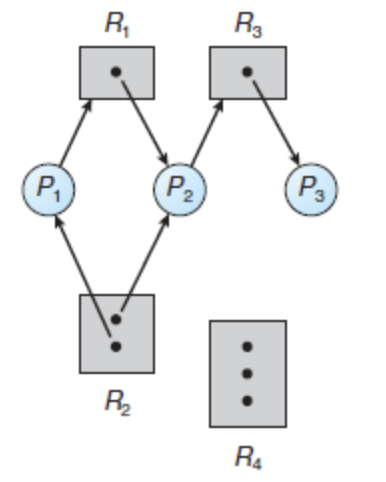
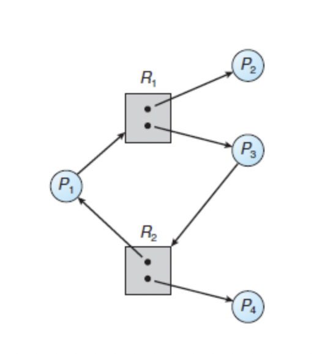

# 08.DeadLock
데드락은 프로세스가 리소스를 점유하고 놓아주지 않거나, 어떠한 프로세스도 리소스를 점유하지 못하는 상태가 되어 프로그램이 멈추는 현상

## System Models
프로세스는 다음과 같은 흐름으로 리소스를 이용한다.
- 요청(Request): 리소스를 요청한다. 만약 다른 프로세스가 리소스를 사용중이라서 리소스를 받을 수 없다면 대기한다.
- 사용(Use): 프로세스는 리소스 위에서 수행된다.
- 방출(Release): 프로세스가 리소스를 놓아준다.

## Deadlock Characterization
데드락 걸린 프로세스들은 실행은 끝낼 수 없으며, 시스템 자원이 묶여 있어서 다른 작업을 시작하는 것도 불가능함
데드락은 다음 4가지 상황을 만족해야 발생한다. 만약 위 조건 중 하나만 만족되지 않아도 데드락은 발생하지 않는다.
- Mutual exclusion: 여러 프로세스 중 하나만 critical section에 진입할 수 있을 때.
- Hold and wait: 프로세스 하나가 리소스를 잡고 있고, 다른 것은 대기중일 때.
- No preemption: OS가 작동중인 프로세스를 임의로 중단시킬 수 없을 때.
- Circular wait: 프로세스가 순환적으로 서로를 기다릴 때.

## Resource Allocation Graph
프로세스 간의 관계를 그래프로 도식화해 보면 데드락이 발생할지 예상할 수 있다. 

P(i)->R(j)는 요청 간선(Request Edge)이고, R(j)->P(i)는 할당 간선(Assignment Edge)이다.
만약 그래프에 순환 고리가 있다면 데드락 위험이 있다는 의미가 된다. 

순환 고리가 있다고 무조건 데드락이 발생하는 것은 아니지만, 순환 고리가 없으면 절대로 데드락이 발생하지 않는다.

## Methods for Handling Deadlocks
데드락을 제어하는 데는 크게 두가지 방법이 있는데, 하나는 데드락을 방지하는 것이고, 또 다른 하나는 데드락을 피하는 것이다

### Deadlock Prevention
데드락을 방지한다는 것은 데드락 발생 조건 중 하나를 만족시키지 않음으로써 데드락이 발생하지 않도록 하는 것이다.
- Mutual Exclusion: critical section problem을 해결하기 위해서는 이 조건을 만족해야 하므로, 공유되는 자원이 있다면 이 조건을 만족시킬 수 밖에 없다.
- Hold and wait: 한 프로세스가 실행되기 전 모든 자원을 할당시키고, 이후에는 다른 프로세스가 자원을 요구하도록 한다. starvation 문제가 생길 수 있다.
- No preemption: 리소스를 점유하고 있는 프로세스가 다른 리소스를 요청했을 때 즉시 리소스를 사용할 수 없다면 점유하고 있던 리소스를 release한다.
- Circular wait: 리소스의 타입에 따라 프로세스마다 일대일 함수로 순서를 지정해준다.
데드락을 방지하는 것은 장치 효율과 시스템 성능을 떨어트리는 문제가 있다.

### Deadlock Avoidance
데드락을 피하는 것은 데드락이 발생할 것 같을 때는 아예 리소스를 할당하지 않는 것이다. 
여기서는 시스템이 unsafe 상태가 되지 않도록 해야 하며, 만약 unsafe 상태가 되면 최대한 빨리 safe 상태로 복구한다. 
데드락 가능성은 포인터로 자원 할당 그래프(Resource allocation graph)를 구현해 판단한다. 
만약 리소스 타입이 여러 개라면 banker’s algorithm을 사용한다.

### Banker’s Algorithm
banker’s algorithm은 Dijkstra가 고안한 데드락 회피 알고리즘이다. 
이는 프로세스가 리소스를 요청할 때마다 수행되며, 만약 리소스를 할당했을 때 데드락이 발생하는지 시뮬레이션한다.

## Recovery from Deadlock
만약 시스템이 데드락을 방지하거나 회피하지 못했고, 데드락이 발생했다면 데드락으로부터 복구되어야 한다. 이때는 어떤 프로세스를 종료시킬지 정하는 것이 중요해진다. 여기에는 몇가지 판단 기준이 있다:

1. 프로세스의 중요도
1. 프로세스가 얼마나 오래 실행됐는가
1. 얼마나 많은 리소스를 사용했는가
1. 프로세스가 작업을 마치기 위해 얼마나 많은 리소스가 필요한가
1. 프로세스가 종료되기 위해 얼마나 많은 리소스가 필요한가
1. 프로세스가 batch인가 interactive한가

### Resource Preemption
데드락을 해결하기 위해 리소스 선점(Preemption) 방식을 사용할 때는 다음과 같은 이슈가 있다.
- Selecting a victim: 어떤 프로세스를 종료시킬 지 결정한다.
- Rollback: 데드락이 발생하기 전 상태로 되돌린다.
- Starvation: 계속 같은 프로세스가 victim이 될 수 있다. 이 경우 기아(Starvation) 문제가 발생한다.

#### 출처
- https://will-behappy.tistory.com/23
- https://parksb.github.io/article/11.html